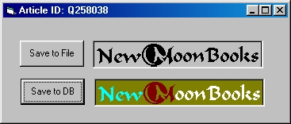



## Access and Modify SQL Server BLOB Data by Using the ADO Stream Object

### Description

The Stream object introduced in ActiveX Data Objects (ADO) 2.5 can be used to greatly simplify the code that needs to be written to access and modify Binary Large Object (BLOB) data in a SQL Server Database. The previous versions of ADO [ 2.0, 2.1, and 2.1 SP2 ] required careful usage of the GetChunk and AppendChunk methods of the Field Object to read and write BLOB data in fixed-size chunks from and to a BLOB column. An alternative to this method now exists with the advent of ADO 2.5. This article includes code samples that demonstrate how the Stream object can be used to program the following common tasks:  

 

<li> Save the data stored in a SQL Server Image column to a file on the hard disk.

<li>Move the contents of a .gif file to an Image column in a SQL Server table.

   

** Article ID: Q258038 - I take no credit for the code, I simply created a project from the example in the article **
 
### More Info
 

             |
---                |---
**Submitted On**   |2000-09-18 22:10:10
**By**             |[Pete Sral](https://github.com/Planet-Source-Code/PSCIndex/blob/master/ByAuthor/pete-sral.md)
**Level**          |Intermediate
**User Rating**    |5.0 (45 globes from 9 users)
**Compatibility**  |VB 5\.0, VB 6\.0
**Category**       |[Databases/ Data Access/ DAO/ ADO](https://github.com/Planet-Source-Code/PSCIndex/blob/master/ByCategory/databases-data-access-dao-ado__1-6.md)
**World**          |[Visual Basic](https://github.com/Planet-Source-Code/PSCIndex/blob/master/ByWorld/visual-basic.md)
**Archive File**   |[CODE\_UPLOAD99669182000\.zip](https://github.com/Planet-Source-Code/pete-sral-access-and-modify-sql-server-blob-data-by-using-the-ado-stream-object__1-11531/archive/master.zip)

